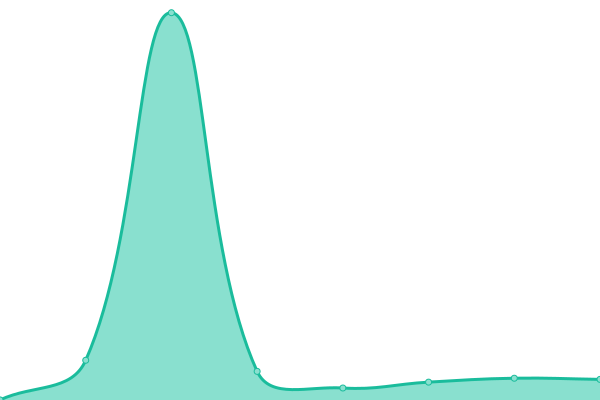

# [📈 Live Status](https://upptime.github.io/upptime): <!--live status--> **🟩 All systems operational**

This repository contains the open-source uptime monitor and status page for [Upptime](https://upptime.js.org), powered by [Upptime](https://github.com/upptime/upptime).

With [Upptime](https://upptime.js.org), you can get your own unlimited and free uptime monitor and status page, powered entirely by a GitHub repository. We use [Issues](https://github.com/upptime/upptime/issues) as incident reports, [Actions](https://github.com/CarfaxMx/status-page/actions) as uptime monitors, and [Pages](https://upptime.github.io/upptime) for the status page.

<!--start: status pages-->
<!-- This summary is generated by Upptime (https://github.com/upptime/upptime) -->
<!-- Do not edit this manually, your changes will be overwritten -->
<!-- prettier-ignore -->
| URL | Status | History | Response Time | Uptime |
| --- | ------ | ------- | ------------- | ------ |
|  [ReporteCari](https://reporte.carinfo.com.mx) | 🟩 Up | [reporte-cari.yml](https://github.com/CarfaxMX/status-page/commits/HEAD/history/reporte-cari.yml) | 

 803ms
     
 | 

<a href="https://CarfaxMx.github.io/status-page/history/reporte-cari">56.95%</a>
    

|  [Pruebas Beta](https://pruebasbeta.globalgbc.com) | 🟩 Up | [pruebas-beta.yml](https://github.com/CarfaxMX/status-page/commits/HEAD/history/pruebas-beta.yml) | 

 463ms
     
 | 

<a href="https://CarfaxMx.github.io/status-page/history/pruebas-beta">100.00%</a>
    

|  [Pruebas Alfa](https://pruebasalfa.globalgbc.com) | 🟩 Up | [pruebas-alfa.yml](https://github.com/CarfaxMX/status-page/commits/HEAD/history/pruebas-alfa.yml) | 

 1076ms
     
 | 

<a href="https://CarfaxMx.github.io/status-page/history/pruebas-alfa">100.00%</a>
    

|  [Reporte Car-Info](https://reporte.car-info.com.mx) | 🟩 Up | [reporte-car-info.yml](https://github.com/CarfaxMX/status-page/commits/HEAD/history/reporte-car-info.yml) | 

 777ms
     
 | 

<a href="https://CarfaxMx.github.io/status-page/history/reporte-car-info">100.00%</a>
    

<!--end: status pages-->

[**Visit our status website →**](https://upptime.github.io/upptime)

## 📄 License

- Powered by: [Upptime](https://github.com/upptime/upptime)
- Code: [MIT](./LICENSE) © [Upptime](https://upptime.js.org)
- Data in the `./history` directory: [Open Database License](https://opendatacommons.org/licenses/odbl/1-0/)
